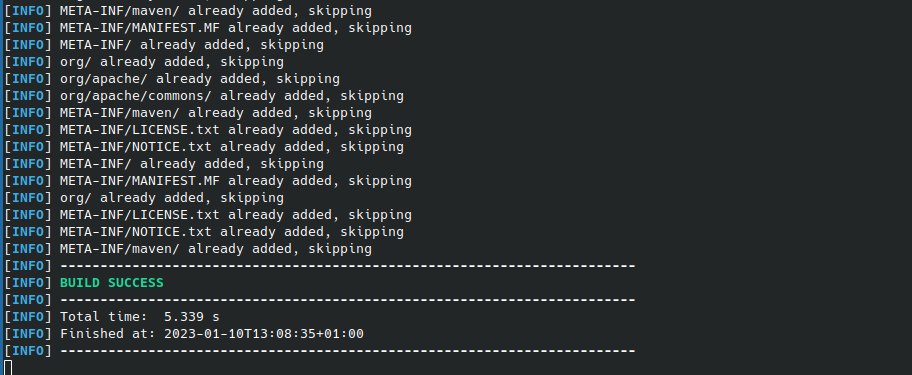
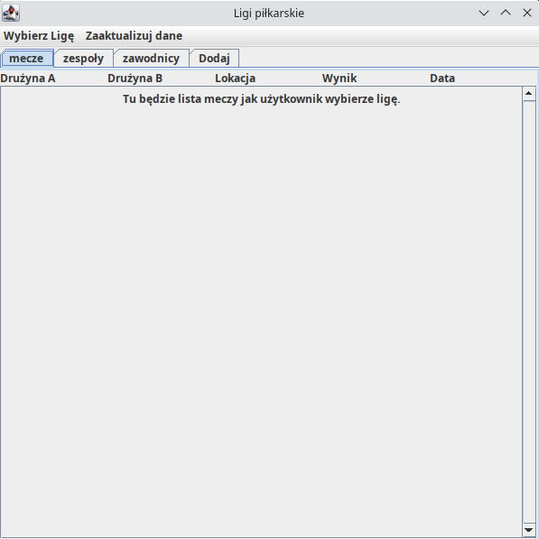
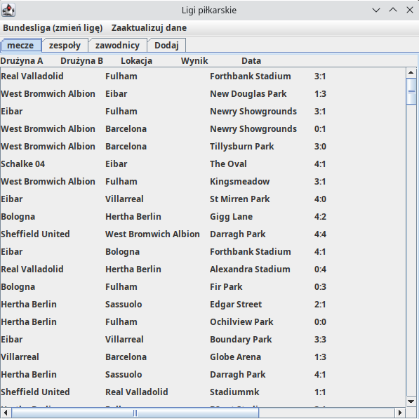

Należy użyć poniższej komendy, aby sklonować to repozytorium na swój komputer

    git clone https://gitlab-stud.elka.pw.edu.pl/jchmiel/pap22z-z29.git
(Należy podać swoją nazwe użytkownika i hasło do serwisu gitlub-stud.elka.pw.edu.pl
Następnie należy przejść do nowo utworzonego katalogu:

    cd pap22z-z29
Następnie należy użyć oprogramowania Maven do skompilowania i uruchomienia aplikacji:

     mvn package; java -jar target/football-1.0.0-jar-with-dependencies.jar

Po uruchomieniu powyższej komendy w konsoli powinny pokazać się komunikaty Maven'a o pomyślnej instalacji, a aplikacja powinna wyświetlić się na ekranie.

Teraz można na przykład wybrać z górnego menu "Bundesliga", aby pobrać informacje o lidze bundesliga z bazy danych. Można teraz przeglądać mecze, zawodników i drużyny do woli.

## Autorzy
 - Paweł Rogóż
 - Zuzanna Damszel
 - Jędrzej Chmiel
## Opis projektu / rozwiązywanego problemu
Nasza aplikacja umożliwia użytkownikom przeglądanie informacji związanych z piłką nożną w różnych ligach. Użytkownik jest też uprawniony do dodawania nowych informacji do bazy danych w aplikacji. Użytkownikami aplikacji w założeniu są kibice bądź osoby zainteresowane piłką nożną, które mogą dzięki naszemu rozwiązaniu sprawdzić wyniki meczów, listy drużyn w ligach, informacje o zawodnikach i wiele innych.
## Wykorzystane narzędzia
W ramach realizacji naszego projektu korzystamy z języka Java oraz biblioteki Swing
